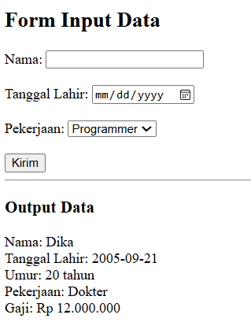
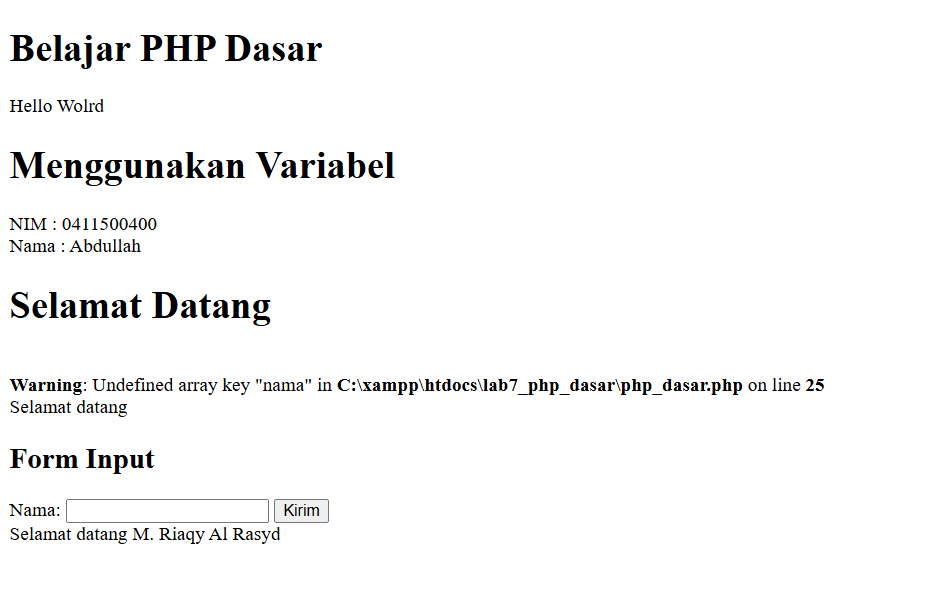
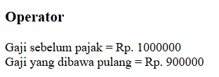
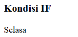
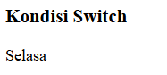
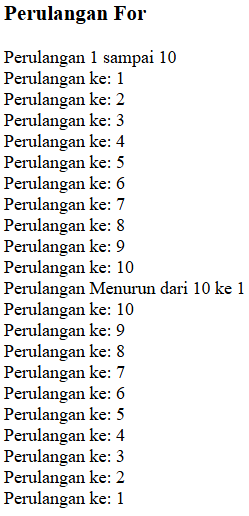
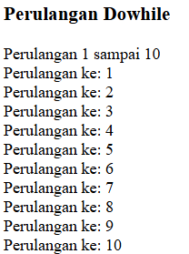

# lab7web

### Nama: M. Rizqy Al Rasyd
### Nim : 312410424
### Kelas : TI.24.A3

# TUGAS
Buatlah program PHP sederhana dengan menggunakan form input yang menampilkan
nama, tanggal lahir dan pekerjaan. Kemudian tampilkan outputnya dengan menghitung
umur berdasarkan inputan tanggal lahir. Dan pilihan pekerjaan dengan gaji yang
berbeda-beda sesuai pilihan pekerjaan.

# JAWAB
## CODE:
```
<!DOCTYPE html>
<html>
<head>
    <title>Form Input PHP</title>
</head>
<body>
    <h2>Form Input Data</h2>
    <form method="post" action="">
        Nama: <input type="text" name="nama" required><br><br>
        Tanggal Lahir: <input type="date" name="tgl_lahir" required><br><br>
        Pekerjaan:
        <select name="pekerjaan" required>
            <option value="Programmer">Programmer</option>
            <option value="Desainer">Desainer</option>
            <option value="Guru">Guru</option>
            <option value="Dokter">Dokter</option>
        </select><br><br>
        <input type="submit" name="submit" value="Kirim">
    </form>

    <?php
    if (isset($_POST['submit'])) {
        $nama = $_POST['nama'];
        $tgl_lahir = $_POST['tgl_lahir'];
        $pekerjaan = $_POST['pekerjaan'];

        $umur = date_diff(date_create($tgl_lahir), date_create('today'))->y;

        switch ($pekerjaan) {
            case "Programmer":
                $gaji = 10000000;
                break;
            case "Desainer":
                $gaji = 8000000;
                break;
            case "Guru":
                $gaji = 6000000;
                break;
            case "Dokter":
                $gaji = 12000000;
                break;
            default:
                $gaji = 5000000;
                break;
        }

        echo "<hr>";
        echo "<h3>Output Data</h3>";
        echo "Nama: $nama <br>";
        echo "Tanggal Lahir: $tgl_lahir <br>";
        echo "Umur: $umur tahun <br>";
        echo "Pekerjaan: $pekerjaan <br>";
        echo "Gaji: Rp " . number_format($gaji, 0, ',', '.') . "<br>";
    }
    ?>
</body>
</html>
```
## OUTPUT:

### PENJELASAN
#### Pada bagian form input
```
<form method="post" action="">
    Nama: <input type="text" name="nama" required><br><br>
    Tanggal Lahir: <input type="date" name="tgl_lahir" required><br><br>
    Pekerjaan:
    <select name="pekerjaan" required>
        <option value="Programmer">Programmer</option>
        <option value="Desainer">Desainer</option>
        <option value="Guru">Guru</option>
        <option value="Dokter">Dokter</option>
    </select><br><br>
    <input type="submit" name="submit" value="Kirim">
</form>
```
* method = "post" adalah data akan dikirim ke server secara tersembunyi(tidak terlihat oleh URL).
* <input\> digunakan agar user dapat mengetikkan nama dan tanggal lahir.
* <select\> digunakan agar user dapat memilih pekerjaanya.
### Pemrosesan data
```
if (isset($_POST['submit'])) {
    $nama = $_POST['nama'];
    $tgl_lahir = $_POST['tgl_lahir'];
    $pekerjaan = $_POST['pekerjaan'];
```
* if (isset($_POST['submit'])) merupakan code untuk memastikan agar code dijalankan setelah tombol kirim ditekan.
* $_POST['nama'] berfungsi untuk mengambil data input yang berisikan nama.
### Menghitung umur
```
$umur = date_diff(date_create($tgl_lahir), date_create('today'))->y;
```
* date_create($tgl_lahir) berfungsi sebagai agar user dapat membuat tanggal.
* date_create('today') berfungsi sebagai tanggal pada hari ini.
* date_diff(...)->y berfungsi untuk menghitung selisih umur.
#### CONTOH:
Jika user lahir pada tanggal 2005-05-21, dan hari ini 2025-11-11 maka umur user sekitar = jadi umur user 20 tahun fungsi ini hanya mengurang tahun user lahir dan tahun user saat ini.
### Menentukan gaji berdasarkan profesi
```
switch ($pekerjaan) {
    case "Programmer":
        $gaji = 10000000;
        break;
    case "Desainer":
        $gaji = 8000000;
        break;
    case "Guru":
        $gaji = 6000000;
        break;
    case "Dokter":
        $gaji = 12000000;
        break;
    default:
        $gaji = 5000000;
        break;
}

```
* switch berfungsi sebagai pilihan kondisi.
* setiap case merupakan pilihan pekerjaan.
* dan jika pekerjaan cocok maka $nilai akan disesuaikan
### Hasil akhir
```
echo "<hr>";
echo "<h3>Output Data</h3>";
echo "Nama: $nama <br>";
echo "Tanggal Lahir: $tgl_lahir <br>";
echo "Umur: $umur tahun <br>";
echo "Pekerjaan: $pekerjaan <br>";
echo "Gaji: Rp " . number_format($gaji, 0, ',', '.') . "<br>";
```
* echo disini berfungsi seperti print pada python yang berfungsi untuk menampilkan.
* number_format($gaji, 0, ',', '.') berfungsi untuk merapihkan nominal uang dari 1000000 menjadi 1.000.000
# BELAJAR PHP DASAR
## Code:
```
<!DOCTYPE html>
<html lang="en">
<head>
    <meta charset="UTF-8">
    <meta name="viewport" content="width=device-width, initial-scale=1.0">
    <title>Php Dasar</title>
</head>
<body>
    <h1>Belajar PHP Dasar</h1>
    <?php
        echo "Hello Wolrd";
    ?>
    
    <h1>Menggunakan Variabel</h1>
    <?php 
    $nim = "0411500400";
    $nama = "Abdullah";
    echo "NIM : " . $nim . "<br>";
    echo "Nama :  $nama";
    ?>


    <h1>Selamat Datang</h1>
    <?php
    echo 'Selamat datang ' . $_GET['nama'];
    ?>

    <h2>Form Input</h2>
    <form method="post">
        <label>Nama: </label>
        <input type="text" name="nama">
        <input type="submit" value="Kirim">
    </form>

    <?php
        echo 'Selamat datang ' . $_POST['nama'];
    ?>

    
</body>
</html>
```
## Output:



# MEMBUAT OPERATOR
## CODE:
``` <h3>Operator</h3>
<?php
    $gaji = 1000000;
    $pajak = 0.1;
    $thp = $gaji - ($gaji*$pajak);
    echo "Gaji sebelum pajak = Rp. $gaji <br>";
    echo "Gaji yang dibawa pulang = Rp. $thp";
?>
```
## OUTPUT:



# KONDISI IF
## CODE:
```
<h3>Kondisi IF</h3>
<?php
$nama_hari = date("l");
if ($nama_hari == "Sunday") {
    echo "Minggu";
} elseif ($nama_hari == "Monday") {
    echo "Senin";
} else {
    echo "Selasa";
}
?>
```
## OUTPUT:



# KONDISI SWITCH
## CODE:
```
<h3>Kondisi Switch</h3>
<?php
$nama_hari = date("l");
switch ($nama_hari) {
    case "Sunday":
        echo "Minggu";
        break;
    case "Monday":
        echo "Senin";
        break;
    case "Tuesday":
        echo "Selasa";
        break;
    default:
        echo "Sabtu";
}
?>
```
## OUTPUT:



# PERULANGAN FOR
## CODE:
```
<h3>Perulangan For</h3>
<?php
echo "Perulangan 1 sampai 10 <br />";
for ($i=1; $i<=10; $i++) {
    echo "Perulangan ke: " . $i . '<br />';
}
echo "Perulangan Menurun dari 10 ke 1 <br />";
for ($i=10; $i>=1; $i--) {
    echo "Perulangan ke: " . $i . '<br />';
}
?>
```
## OUTPUT:



# PERULANGAN DOWHILE
## CODE:
```
<h3>Perulangan Dowhile</h3>
<?php
echo "Perulangan 1 sampai 10 <br />";
$i=1;
do {
    echo "Perulangan ke: " . $i . '<br />';
    $i++;
} while ($i<=10);
?>
```
## OUTPUT:



